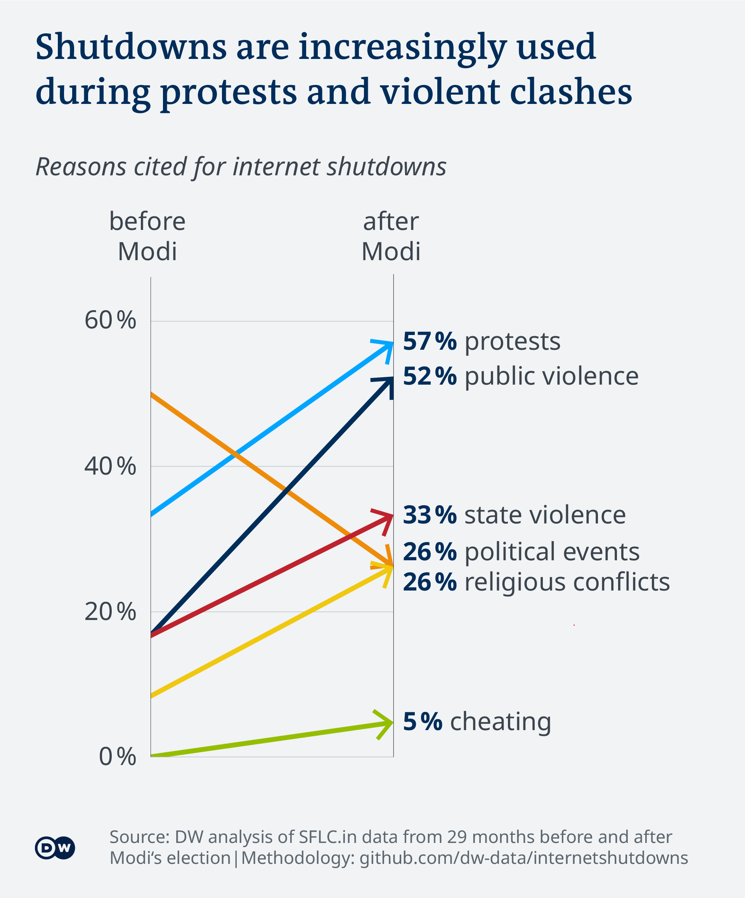

# Internet shutdowns in India

_Idea, research, data analysis, and writing:_  [Nehal Johri](https://twitter.com/NehalJohri)

_Data visualization:_  [Kira Schacht](https://twitter.com/daten_drang)

**Read the full article on DW.com:** English

India shuts downs the internet more than any other country. Kashmiris, in the north, have had no internet for over a year now. A DW analysis finds that shutdowns are strategically used to clamp down on dissent. 

DW looked at almost 400 shutdowns that took place between January 2012 and March 2020, and identified the deeper context in which they occurred.

The following text will explain the process behind this story: Which data sources were used, how the analysis was conducted and how the data was visualized.

# Source data

SFLC is a legal services organization in India that has been tracking internet shutdowns since January 2012. According to Radhika Jhalani, a lawyer at SFLC who is currently in charge of the project, SFLC verifies each shutdown using news reports or citizen reports from at least 10 people in the affected area.

**Link:** [SFLC.in: Internet shutdowns tracker in India](https://internetshutdowns.in/)

*Internet shutdowns in India from January 2012 to March 2020. Source data extracted on 24th March, 2020, at 14∶54∶15 CET.*

# Analysis

## Verifying each internet shutdown

When DW started its analysis, the dataset had 385 incidents of internet shutdowns in India. Each entry was verified by following the linked news report. When links were broken or unavailable, reports from other news organizations were used to verify the event. In 3 cases, no alternative sources could be identified. These rows were excluded from the dataset, leaving 382 shutdowns included in the analysis.

## Quantitative content analysis

To identify the circumstances in which the shutdowns occurred, DW analyzed these news reports using a quantitative content analysis: A series of tags for possible circumstances were picked and reports were analyzed according to which tags applied to each.

A set of 20 random events across the dataset were chosen to identify the circumstances under which the internet was shut down. Based on these, a limited number of tags – which appeared to be the most meaningful – were picked to analyze the dataset.

The 9 tags used in the analysis are: ‘state violence’, ‘public violence’, ‘extremist violence’, ‘misinformation’, ‘cheating’, ‘religious conflict’, ‘political event’, ‘protest’ and ‘anti-CAA’.

All 382 events were then individually labeled by reading through corresponding news reports and descriptions given by SFLC.in, using a binary system (`1 = TRUE; 0 = FALSE`). Each event could be marked with multiple tags. Events were marked with an average of 2.5 tags. Each report was read and tagged by at least two people.

### Definitions for each tag

**state violence:** authorities were involved in the violence preceding the shutdown. These are security forces, the army, the police etc.

**public violence:** some form of violence by the general public preceded the shutdown. It could be violence amongst people at protests, destruction of public property, burning of cars and shops etc. Any reference to “clashes” or “riots” warrants this tag. It does _not_ include violence by police or other state forces, and violence by any group of people identified as extremists, militants or terrorists. Also tagged if the declared aim of the shutdown is to _prevent_ public violence.

**extremist violence:** the circumstances preceding the shutdown include violence by individuals referred to as militants, extremists or terrorists. This includes gunfights with security forces or bomb blasts. Also tagged if the declared aim of the shutdown is to _prevent_ extremist violence.

**misinformation:** any case in which it’s claimed that shutting down information exchange via social networks was done to ”check the spread of rumours”. Claims of “misinformation” or “fake news” also fall within this tag. Mentions of merely “misuse of internet”, “propaganda” or “inflammatory messages” do not satisfy the criteria”.

**cheating:** any case the internet was cut off to prevent people from cheating in exams.

**religious conflict:** any case in which a religious group or caste is mentioned in connection with the shutdown. For example when the Ayodhya verdict was announced by the Supreme Court in 2019: Hindus and Muslims had been fighting over a patch of land that has held a temple and a mosque at different times in history.

**political event:** court rulings, passing of laws (including the Citizenship Amendment Act of 2019), elections, events involving recent politicians, and national political holidays (such as Republic Day and Independence Day).

**protest:** any protest or “bandh” (strike) in the country, including anti-CAA (Citizenship Amendment Act of 2019) protests. Also tagged if the declared aim of the shutdown is to _prevent_ protests.

**anti-CAA:** any protests against the Citizenship Amendment Act of 2019. Read more: [India: Massive protests against citizenship law](https://p.dw.com/p/3UsIf)

### Examples

**1. Gunfight occurs between security forces and militants**

state violence = 1, extremist violence = 1, all other categories = 0

_News report:_  [https://www.business-standard.com/article/news-ians/five-militants-killed-two-policemen-injured-in-kashmir-third-lead-119053101469_1.html](https://www.business-standard.com/article/news-ians/five-militants-killed-two-policemen-injured-in-kashmir-third-lead-119053101469_1.html)

**2.  Ayodhya verdict to be announced may cause tensions**

public violence = 1, religious conflict = 1, political event = 1, all other categories = 0

_News report:_  [https://thewire.in/tech/ayodhya-verdict-internet-suspended-in-parts-of-india](https://thewire.in/tech/ayodhya-verdict-internet-suspended-in-parts-of-india)

**3. After communal clashes over the harassment of three Muslim men, allegedly fake videos and rumours were posted on social media**

public violence = 1, misinformation = 1, protest = 1, all other categories = 0

_News report:_ [https://www.ndtv.com/india-news/asansol-after-reports-of-communal-tension-internet-suspended-in-bengals-asansol-2075484](https://www.ndtv.com/india-news/asansol-after-reports-of-communal-tension-internet-suspended-in-bengals-asansol-2075484)

## Identifying most common circumstances

To find out which circumstances warranted the most internet shutdowns, the number of entries under each tag was summed up. Different combinations of tags were scrutinized as well.

For instance, 173 of the analyzed shutdowns, or 45%, featured state violence. How many of these were gunfights between security forces and militants in Kashmir? Since such encounters are always tagged with ‘state violence’ and ‘extremist violence’ and, their number could be tallied to 106, or 62% of all cases of state violence.

## Identifying changes under Modi

To analyze whether and how the circumstances of internet shutdowns have changed since Narendra Modi became prime minister of India in May 2014, DW compared the frequency of different tags in the 29 months before and after Modi took office. This covers recorded shutdowns between 01.01.2012 (the start of the data collected by SFLC) and 01.11.2016.

This analysis only includes tags that occurred at least once in this timeframe.

